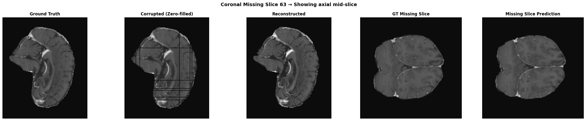
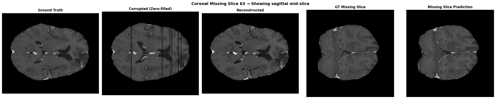
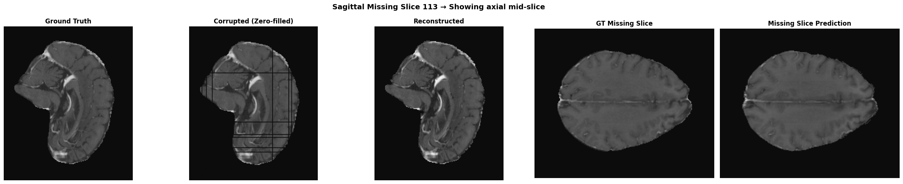

## 3D Kernel Guided Conditional Diffusion for Reconstruction of Undersampled and Noisy MRI Data

This repository contains the implementation of our proposed work for 3D reconstruction of Undersampled and Noisy MRI Data using Conditional Diffusion Model with Kernel Regularized Loss Function.

The reposistory structure is as below:

- assets (Contains result images)
- checkpoints (Contains all Trained Weights)
- config (Contains all Config files)
- test_samples (Contains Sample Test Data)
- src (Contains all Model implementation Code)
- utils (Contains Utils files i.e. Dataloader, Training Scripts, Inference Scripts)
- requirements.txt (Conaints info of required dependencies)

## Running Model and Performance Visualization

First, install all required dependencies and using Python version 3.13.5:

```bash
pip install -r requirements.txt
```

After installing the requirements, open the run-test.ipynb notebook.
In this notebook, you can:

- Provide the paths to your sample MRI data and checkpoints.
- Run the model inference
- Visualize the reconstruction results
- Evaluate and check the performance metrics

## Sample Results

### Reconstructed Volume along Axial, Coronal and Sagittal


### Reconstrcuted Volume Comparison with Corrupted Volume



